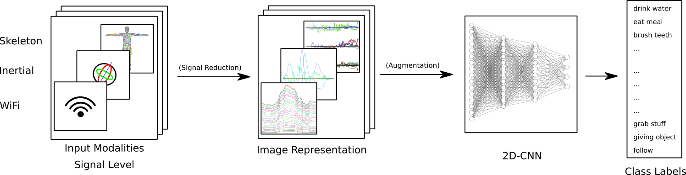
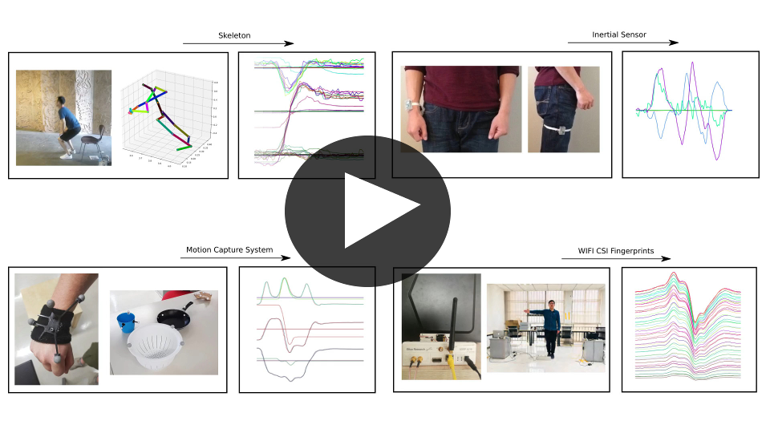

# Gimme Signals

This repository contains the action recognition approach as presented in the Gimme Signals paper.



* A preprint can be found on [arxiv](https://arxiv.org/abs/2003.06156).
* A short overview video is available on [youtube](https://www.youtube.com/watch?v=EHRgX0_G-j4).

<!--<section id="video" class="bg-light">-->
## Video
<video width=100% controls>
<source src="video/gimme_signals.mp4">
</video>

### TODO Upload and update video on youtube

[](https://userpages.uni-koblenz.de/~raphael/videos/gimme_signals.mp4)

In case the video does not play you can download it [here](https://userpages.uni-koblenz.de/~raphael/videos/gimme_signals.mp4)

## Citation


```
@article{memmesheimer2020gimme,
  title={Gimme Signals: Discriminative signal encoding for multimodal activity recognition},
  author={Memmesheimer, Raphael and Theisen, Nick and Paulus, Dietrich},
  journal={arXiv preprint arXiv:2003.06156},
  year={2020}
}
```

## Requirements

* pytorch, torchvision, pytorch-lightning, hydra-core
* `pip intall -r requirements.txt`

## Generate Representation

### TODO: add code for representation generation

Representations must be placed inside a `$DATASET_FOLDER` that an environment variable points to.

### Precalculated representations

We provide precalculated representations for intermediate result reproduction:

* [NTU RGB+D 120 Cross Subject](https://agas.uni-koblenz.de/gimme_signals/ntu_120_cross_subject.tar.gz)
* [Simitate (MoCap)](https://agas.uni-koblenz.de/gimme_signals/precal_representation_simitate.zip)
* [UTD-MHAD (Inertial and Skeleton)](https://agas.uni-koblenz.de/gimme_signals/precal_representation_utdmhad.zip)
* [ARIL (Wi-Fi)](https://agas.uni-koblenz.de/gimme_signals/precal_representation_aril.zip)

## Train

Example:

### Simitate

`python train.py dataset=simitate model_name=efficientnet learning_rate=0.1 net="efficientnet"`

Exemplary, this command trains using the simitate dataset.

